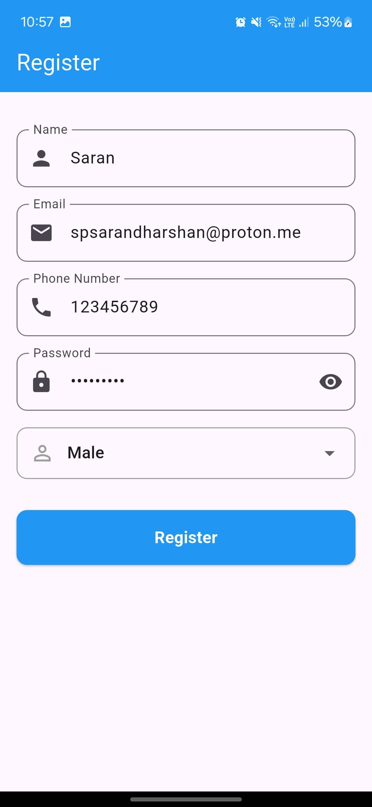
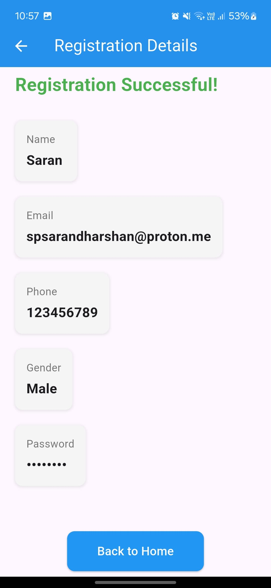

# Flutter Registration App

A simple Flutter application that demonstrates a user registration flow with form validation and navigation between screens.

## Features

- User-friendly registration form with the following fields:
  - Name
  - Email
  - Phone number
  - Password (with show/hide functionality)
  - Gender selection (Male/Female/Others)
- Form validation to ensure all fields are filled
- Navigation to a details screen after successful registration
- Display of user information on the details screen
- Clean and responsive UI design

## Screenshots

<table>
  <tr>
    <td></td>
    <td></td>
  </tr>
</table>


## Getting Started

### Prerequisites

- Flutter SDK (3.29.3 or higher)
- Dart SDK (3.7.2  or higher)
- Android Studio / VS Code
- Android Emulator / iOS Simulator / Physical device

### Installation

1. Clone this repository:
   ```bash
   git clone https://github.com/yourusername/flutter_registration_app.git
